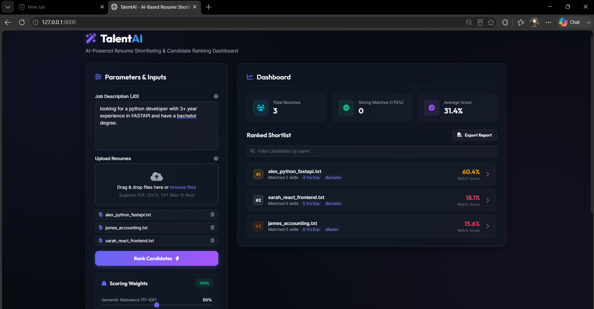
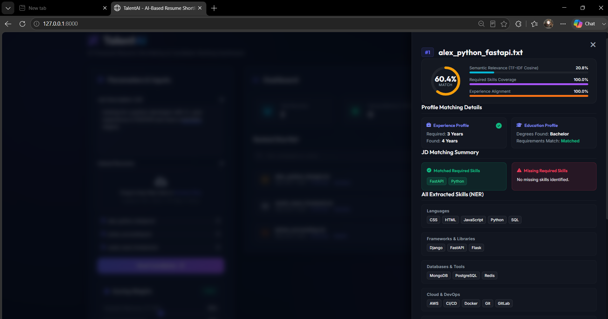

# TalentAI — AI-Based Resume Shortlisting System

**TalentAI** is a premium, lightweight, and highly interactive recruiting intelligence tool designed to automate candidate shortlisting. It parses candidate resumes (PDF, DOCX, TXT) and matches them against job descriptions using Natural Language Processing (NLP) similarity scoring, named entity skill checks, and experience alignment checks. 

The application is completely self-contained, offline-compatible, and features a state-of-the-art glassmorphic dark dashboard.

**Author:** Raj Singh (AI & Full Stack Developer) 

---

## Key Features

1. **Robust Multi-format Document Ingestion**: Supports parsing text from PDF (`PyPDF2`), Word (`python-docx`), and raw text files (`.txt`).
2. **Hybrid NLP Scoring Algorithm**: Computes final scores using three key parameters:
   - **Semantic Relevance (TF-IDF & Cosine Similarity)**: Measures context alignment of vocabulary.
   - **Required Skills Match**: Computes skill coverage percentage based on a standard professional skills index.
   - **Years of Experience Match**: Extracts experience durations using pattern matching rules to verify if candidates meet the job threshold.
3. **Interactive JD Requirements Editor**:
   - Extracted job requirements (skills, min experience, degrees) display as interactive chips.
   - Recruiters can add or delete required skills, which **instantly recalculates scores and re-ranks candidates** on the client side without needing server round-trips.
4. **Dynamic Score Sliders**: Recalculate candidate matching scores dynamically by adjusting parameter weight sliders (Semantic Relevance, Skills Match, and Experience Match).
5. **Detailed Evaluation Drawer**: Opens a slide-out inspect drawer mapping matched vs. missing skills, degree requirements alignment, and raw resume snippet previews.
6. **CSV Shortlist Export**: Export shortlisting results into a professional spreadsheet format with a single click.

---

## Visual Previews

### Initial Web Dashboard View


### Uploading Resume And divide score on which basis


### Candidate Detailed Drawer Open



---

## Technology Stack

- **Backend Architecture**: Python 3, FastAPI, Uvicorn, Scikit-learn (Machine Learning TF-IDF), PyPDF2, python-docx.
- **Frontend Architecture**: HTML5, Vanilla CSS3 (Custom Glassmorphism, animations), Modern ES6 JavaScript.

---

## Installation & Setup

### Prerequisites
Ensure you have **Python 3.8+** installed on your system.

### 1. Install Dependencies
Open your terminal in the project root directory and run:
```bash
pip install -r requirements.txt
```

### 2. Run the Application
For Windows users, simply double-click the launcher script:
```bash
start.bat
```
Alternatively, start the server manually by running:
```bash
cd backend
python main.py
```
Then navigate to **`http://127.0.0.1:8000`** in your browser.

---

## Directory Layout
```text
resume-shortlister/
├── backend/
│   ├── main.py          # FastAPI application & API routers
│   ├── nlp_engine.py    # Document parsing, TF-IDF, Cosine Similarity & NER
│   └── test_nlp.py      # Automated validation tests
├── frontend/
│   ├── index.html       # HTML structure for uploader and dashboard
│   ├── style.css        # Glassmorphic styles & animations
│   └── app.js           # Client-side recalculations, sorting & export controls
├── dummy_resumes/       # Sample candidate resumes for evaluation
├── screenshots/         # Captured images
├── requirements.txt     # Python package requirements
└── start.bat            # Quick application launcher
```
