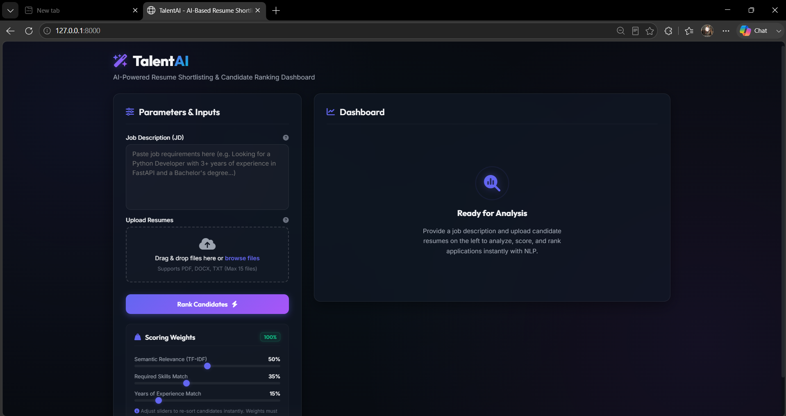
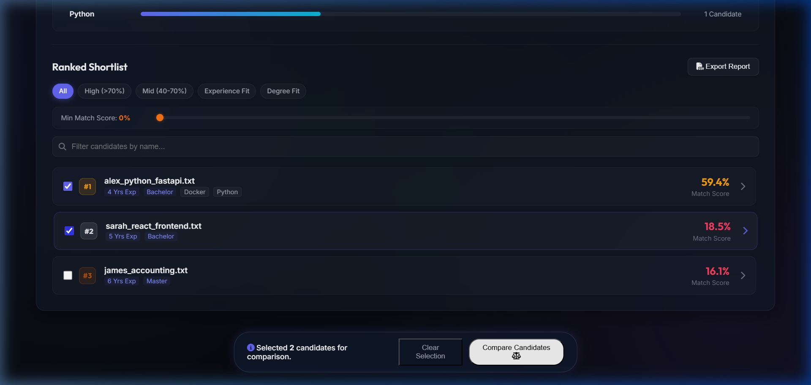
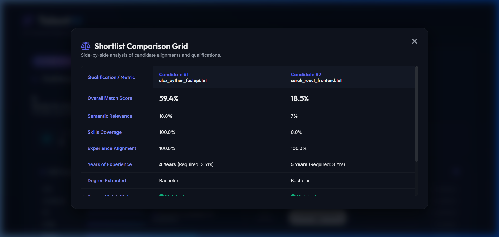
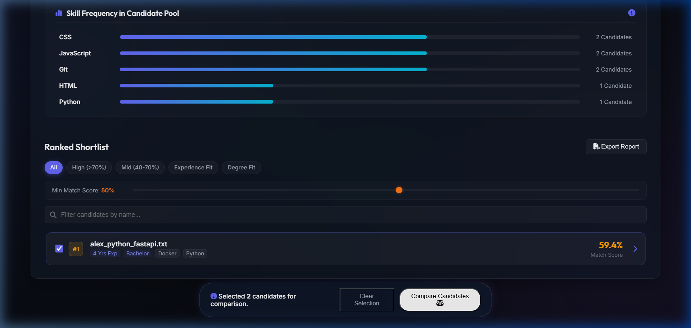
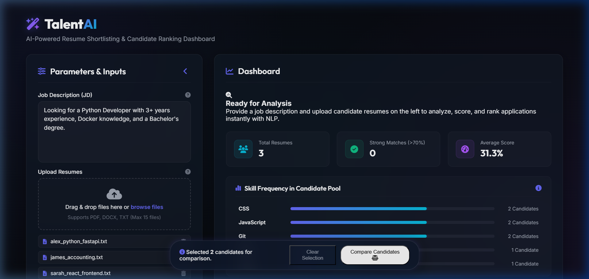

# TalentAI — AI-Based Resume Shortlisting System

**TalentAI** is a premium, lightweight, and highly interactive recruiting intelligence tool designed to automate candidate shortlisting. It parses candidate resumes (PDF, DOCX, TXT) and matches them against job descriptions using Natural Language Processing (NLP) similarity scoring, named entity skill checks, and experience alignment checks. 

The application is completely self-contained, offline-compatible, and features a state-of-the-art glassmorphic dark dashboard.

**Author:** Raj Singh  

---

## Key Features

1. **Robust Multi-format Document Ingestion**: Supports parsing text from PDF (`PyPDF2`), Word (`python-docx`), and raw text files (`.txt`).
2. **Parallel & Efficient Processing**: Leverages a python `ThreadPoolExecutor` and async file loaders to parse multiple resume documents concurrently, reducing backend extraction bottlenecks.
3. **Multi-stage Loader Tracker (Phase 4)**: Shows a fullscreen processing overlay that ticks through the pipeline stages: Parallel Ingestion -> TF-IDF Mapping -> Semantic Cosine Computations -> Skill Alignment Calculations.
4. **Hybrid NLP Scoring Algorithm**: Computes final scores using three key parameters:
   - **Semantic Relevance (TF-IDF & Cosine Similarity)**: Measures context alignment of vocabulary.
   - **Required Skills Match**: Computes skill coverage percentage based on a standard professional skills index.
   - **Years of Experience Match**: Extracts experience durations using pattern matching rules to verify if candidates meet the job threshold.
5. **Interactive JD Requirements Editor**:
   - Extracted job requirements (skills, min experience, degrees) display as interactive chips.
   - Recruiters can add or delete required skills, which **instantly recalculates scores and re-ranks candidates** on the client side without needing server round-trips.
6. **Collapsible Parameters Sidebar (Phase 4)**: 
   - After ranking candidates, the parameters sidebar automatically collapses to clear up workspace clutter, expanding the dashboard layout to full-width.
   - Recruiters can click the **Modify Criteria** button at any time to slide the parameters sidebar back into view.
7. **Match Score Threshold Filter (Phase 4)**: 
   - An interactive match score slider allows recruiters to filter out candidates who fall below a desired match percentage (e.g. 50% match score minimum) instantly.
8. **Shortlist Comparison Matrix (Phase 4)**:
   - Recruiters can select up to 3 candidate checkboxes to compare their qualifications side-by-side.
   - Displays a side-by-side table matrix comparing Match Scores, Semantic Relevance, Skill Coverage, Experience Years, Degrees, Matched Skills, and Missing Skills.
9. **Interactive Skill Frequency Breakdown**:
   - Renders a pool breakdown chart showing the distribution of skills in the candidate pool.
   - Clicking a skill bar filters the candidate shortlist deck to show only candidates possessing that specific skill.
10. **Smart Category Filter Badges**:
    - Toggle filters for score tiers (`High >70%`, `Mid 40-70%`), `Experience Fit`, and `Degree Fit` with animated CSS transitions.
11. **Dynamic Resume Skill Highlighter**:
    - Scans candidate text and highlights matched skills in glowing emerald and missing required skills in soft coral inside the resume inspection drawer.
12. **Dynamic Score Sliders**: Recalculate candidate matching scores dynamically by adjusting parameter weight sliders.
13. **CSV Shortlist Export**: Export shortlisting results into a professional spreadsheet format with a single click.

---

## Visual Previews

### Initial Web Dashboard View


### Floating Compare Action Bar & Shortlist Cards (Phase 4)


### Side-by-Side Comparison Grid (Phase 4)


### Score Threshold Filter Applied (Phase 4)


### Layout Restored Sidebar (Phase 4)


---

## Technology Stack

- **Backend Architecture**: Python 3, FastAPI, Uvicorn, Scikit-learn (Machine Learning TF-IDF), PyPDF2, python-docx, Asyncio, ThreadPoolExecutor.
- **Frontend Architecture**: HTML5, Vanilla CSS3 (Custom Glassmorphism, charts, filters, comparison grid), Modern ES6 JavaScript.

---

## Installation & Setup

### Prerequisites
Ensure you have **Python 3.8+** installed on your system.

### 1. Install Dependencies
Open your terminal in the project root directory and run:
```bash
pip install -r requirements.txt
```

### 2. Run the Application
For Windows users, simply double-click the launcher script:
```bash
start.bat
```
Alternatively, start the server manually by running:
```bash
cd backend
python main.py
```
Then navigate to **`http://127.0.0.1:8000`** in your browser.

---

## Directory Layout
```text
resume-shortlister/
├── backend/
│   ├── main.py          # FastAPI application & API routers
│   ├── nlp_engine.py    # Document parsing, TF-IDF, Cosine Similarity & NER
│   └── test_nlp.py      # Automated validation tests
├── frontend/
│   ├── index.html       # HTML structure for uploader and dashboard
│   ├── style.css        # Glassmorphic styles & animations
│   └── app.js           # Client-side recalculations, sorting, comparing & export controls
├── dummy_resumes/       # Sample candidate resumes for evaluation
├── screenshots/         # Captured images & demo webp
├── requirements.txt     # Python package requirements
└── start.bat            # Quick application launcher
```
